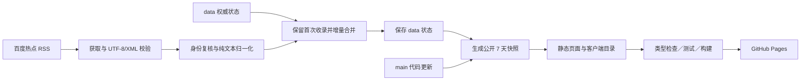

# MVP 页面与数据架构

日期：2026-10-03。已批准的架构原则以 [决定记录](mvp-decisions.md) 为准。下列具体文件名、schema、算法与控制策略是工程建议，尚无应用代码或运行证明。

## 已批准结构

- Astro＋TypeScript＋Tailwind CSS＋原生交互脚本，无后端/数据库/用户系统。
- Node 24.18.0、pnpm 10.26.2、pnpm-lock.yaml；Node test runner＋Playwright 1.63.0。
- main 代码、拟定 data 分支权威状态；采集保存与站点发布分离。
- 当前详情静态预生成，过期移除并用 404，HTML 优先、JS 渐进增强。



## 建议代码边界与目录

这是未来布局，不是已创建文件：

```text
src/
  domain/                 # 纯规则、类型、排序/窗口；不得导入 Node I/O 到浏览器
  components/             # 头部主题、导航/目录、条目、侧栏、分页、显示控件
  layouts/                # 统一报刊框架、元信息、ClientRouter
  client/                 # 临时状态、列表增强、主题、菜单、目录、动效
  generated/              # 从权威状态生成的只读构建输入，不作第二权威库
  pages/
    index.astro
    items/[id].astro
    sources.astro
    about.astro
    principles.astro
    privacy.astro
    404.astro
scripts/
  ingestion/              # Node 专属获取、RSS 解析、状态读写与合并
  snapshot/               # 校验状态、生成当前公开快照
tests/
  data/                   # 合成测试资料，不冒充真实新闻
  e2e/                    # 真实浏览器交互与降级
.github/
  workflows/
  ISSUE_TEMPLATE/
```

## data 分支契约（MVP-Q16 已确认三文件分离）

用同一 Git 提交保存相关文件，避免身份台账与内容错配：

| 文件 | 内容 |
| --- | --- |
| state.json | schemaVersion、状态时间、身份台账、来源尝试/成功/异常状态 |
| items.json | 当前窗口内的已接受条目内容 |
| manifest.json | 前两个文件的摘要与生成信息，用于复核版本 |

建议身份台账至少保留：稳定 ID、来源 ID、原 GUID、首次收录时间、搜索关键词指纹，无限保留（MVP-Q14）；过期删除标题/摘要等当前可读内容，保留身份依据防止旧 GUID 被当作新条目。
稳定 ID 已确认为完整 SHA-256 的“来源 ID + 分隔符 + 原始 GUID”元组摘要，输出 64 位十六进制，不截断（MVP-Q15）；GUID 保持字符串，不转数字/小写。最终字段名实施时固定。
建议用 URL 查询参数规范提取 wd，再精确比较解码后的字符串；不从标题反推、不随意删除词内空白。保留原目标链接并做协议/目标校验。

来源请求、XML 解析和字段校验由不同层负责。当前 rss-parser 的 RSS description 映射为 content/contentSnippet，不能假设其 Item 有 description 字段；Snippet 不自动限 300 字。其日期格式转换不提供新闻发布时间可靠性证明。

## 发布视图与页面

生成公开快照时固定一个时间基准，服务器统一筛选 7 天窗口并排序。浏览器不按自己的时钟删内容或重新解释发布时间。
建议同时间条目用稳定 ID 作确定性次序；不能从 GUID 大小或热度推断时间。
建议公开快照包含 schemaVersion、快照时间、可读条目、公开来源状态以及可读内容版本；内容版本应排除仅尝试时间变化，避免虚报“内容已更新”。
详情用 getStaticPaths 生成当前 ID 路由；404 不宣称能区分“曾存在已过期”与“从未存在”。所有路径经基路径处理，项目真实 404 行为需线上验证。

客户端只使用同源生成目录，不直接请求上游 feed。数据作为构建导入/独立 JSON 资产，避免把未经安全编码的来源字符串拼入内联 script 或 innerHTML。
首页先输出可读首屏及简版条目目录；增强成功后提供筛选分页。脚本失败也必须能看到目录，不能只依赖 noscript。

## 客户端生命周期建议

Astro ClientRouter 可提供同页文档导航与 window 内存连续性，但不会自动保存本项目筛选、页码或位置。
建议当前访问状态集中在项目命名空间，记录主题、页码、条目锚点/滚动、内容版本；导航前捕获，导航后清理/重绑事件并恢复。
刷新/新访问重置。不同内容版本时按 MVP-Q12 回退；状态恢复不能写浏览器持久存储。浏览器标准导航机制不等同于自建阅读记录。
返回同源主站但离开项目的链接应走原生导航；不能把主站 HTML 当项目页面局部交换。主题用项目专属存储 key，名称实施前固定。
动效按 ui-design.md 编排，可取消、尊重减少动态效果；HTML 内容默认可见，失败不得留下永久遮罩。

## 工作流与失败控制建议

- 定时/手动：读取可信状态 → 获取/归一化 → 保存权威状态 → 生成快照 → 检查/构建 → 发布。
- main 推送：读取已保存状态 → 生成快照 → 检查/构建 → 发布，不抓源、不写首次收录。
- PR：检查与测试，不写 data、不发布网站。
- 保存失败不进入新的权威版本；保存已成功而构建/部署失败，不回滚收录时间。
- 来源失败但旧数据可信，保存真实尝试状态并构建降级快照；不能更新获取成功时间。

以下第 1、2、4 项及关键词规则、隔离展示、八项常规工程方案已于 2026-10-03 确认（MVP-Q13–Q22）；其余实施前固定并写验收用例：

1. 首次 data 初始化使用独立手动入口；后续缺失/损坏状态停止写入与发布，不自动清空台账重新采集。（已确认，见 MVP-Q13）
2. 所有实际发布串行控制；写 data 前记录读取时的提交版本，写回时分支已前进则该次运行失败并报告冲突，等下次重试；不自动合并，不 force push。（已确认，见 MVP-Q17）
3. 构建记录固定代码版本和数据版本；不能读取变化中的分支文件拼成混合快照。（机制已按 MVP-Q21 第 2 项固化）
4. 不另建辅助备份机制，data 分支 Git 历史即唯一可信恢复来源；仓库整体丢失属 GitHub 账号层风险，不在 MVP 范围。（已确认，见 MVP-Q18）
5. 允许构建的依赖脚本按实际锁文件/安装结果逐项确定；不套用新版 pnpm 参数或全局允许所有 scripts。

搜索关键词提取与比较规则已确认（MVP-Q19）：从目标链接解析查询参数取 `wd`，多个取第一个并记录原始；解码后字符串精确相等才算一致，不 trim、不归一化空白、不从标题反推；缺失 `wd` 的条目照常收录但指纹记空、跳过冲突检测。

隔离条目公开可见度已确认（MVP-Q20/Q22）：来源页公开列出被隔离条目，展示原始标题、目标链接、隔离原因类别、隔离时间四项字段，纯文本安全输出并明确标注隔离状态；隔离列表随 7 天公开窗口滚动，移出展示后身份与异常记录按 MVP-Q14 保留在台账；隔离列表变化计入公开快照内容版本。

发布前另核实来源内容使用边界。上述初始化、并发、schema 与恢复建议不是已经部署的能力。
